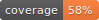

[](https://python-poetry.org/)
[](https://github.com/psf/black)


# GPTagger :label:

GPT Tagger is a powerful text tagger that makes use of the GPT model. This tool allows you to extract tags from a given text by leveraging the capabilities of GPT. However, using GPT as a text tagger is not a trivial task. GPT has the tendency to generate non-existing, fabricated, or processed text. To mitigate this issue, GPT Tagger provides a reliable method to ensure that the generated tags are derived from the input text while allowing GPT to process the extracted tags to some extent.

Below is an example of how GPT may respond wrong. 

```md
Text: "I earn $1000 this week!"
Prompt: "Extract how much he/she earns"

# Non-existent text
GPT: "one thousand dollar"
# Make-up text
GPT: "$999999"
# Processed text
GPT: "$1,000"
```

## Introduction


These incorrect responses highlight the importance of using a reliable tag extraction tool like GPT Tagger. To do that, GPT Tagger follows a set of main steps:
1. 🕵️‍♀️ Extraction: GPT Tagger sniffs out all possible tags by following your instructions to GPT.
2. 🔍 Indexing: It spots the exact locations of these tags within the text.
3. ✅ Validator: GPT Tagger's trusty validator steps in to validate if the extracted tags pass the rule-based and ML-based checks.

Check the example above how we extract ingredients from a yummy recipe text. 😋

## Features ✨

### Scale up GPT annotators and use switch between GPT3.5 and GPT4 easily
- Want to have a higher precision? try using GPT-4!
- Want to have a higher recall? Scale up the number of GPT annotators!

### Instead of making a perfect prompt, use validator to shave off bad extractions
- Simple validator: Length, Regex...
- ML validator: GPT validator (Consider it like a chain of GPTs!)

## How to Use 🚀

### Setup

```shell
make install
export OPENAI_API_KEY=<your-key>
```

### Pre-defined NER pipeline

The easiest way to dive into the GPT Tagger is through the Gradio web demo! Fire it up with a single command:
```shell
poetry run python GPTagger/app.py
```

If you prefer having the power of GPT Tagger at your fingertips in Python, check out this snippet:

```python
from pathlib import Path
from GPTagger import *

cfg = NerConfig(
    tag_name='date',
    tag_regex=r"\d",
    tag_max_len=128,
)
prompt = PromptTemplate.from_template(Path('<path-to-prompt>').read_text())
pipeline = NerPipeline.from_config(cfg)

doc = Path('<path-to-doc>').read_text()
tags = pipeline(doc, prompt)
```

### Build Custom Pipelines 🎉

We believe that the possibilities of using GPT as a text tagger are endless! We invite you to contribute your own custom pipelines. Together, we'll unlock the true potential of GPT Tagger and make text tagging an better experience.

Leave a star if you find GPTagger is useful for your product or company! 🌟